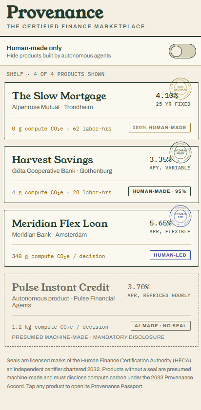
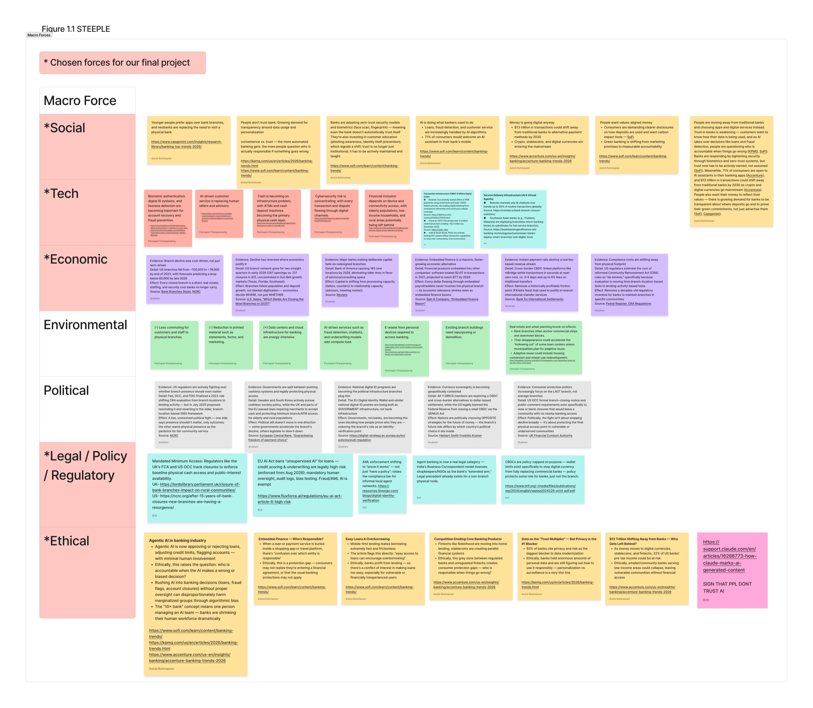
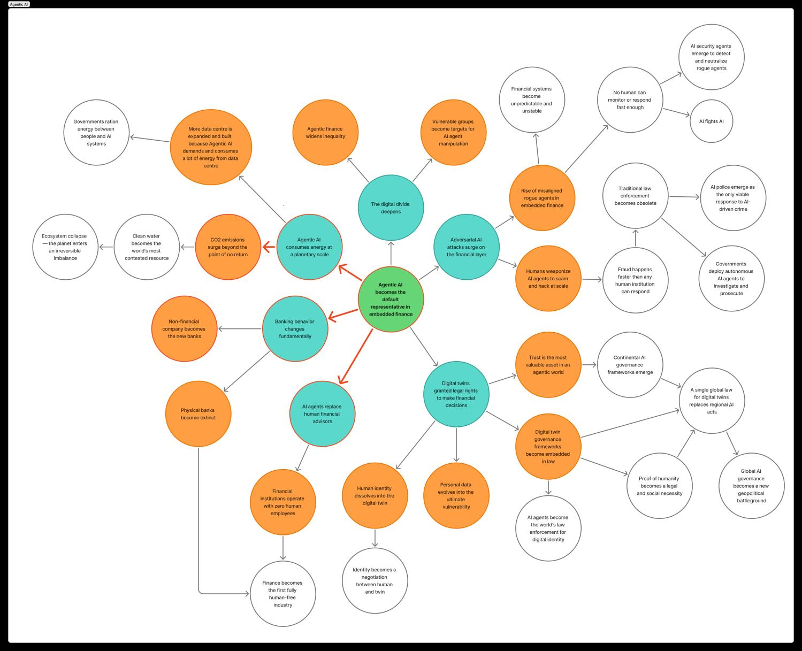
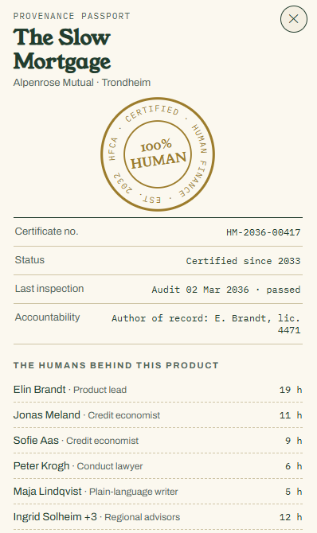
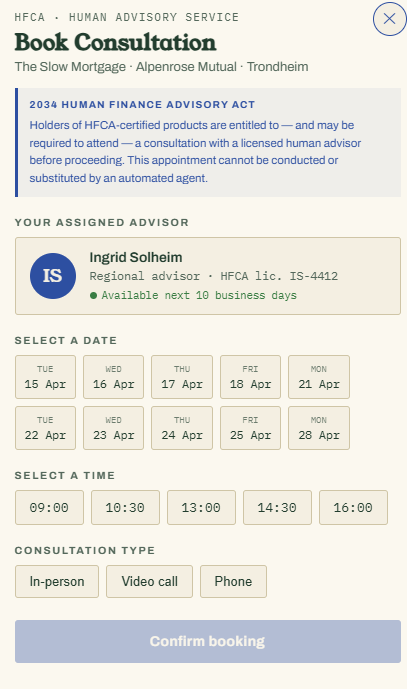
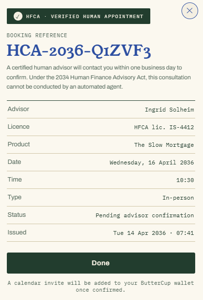
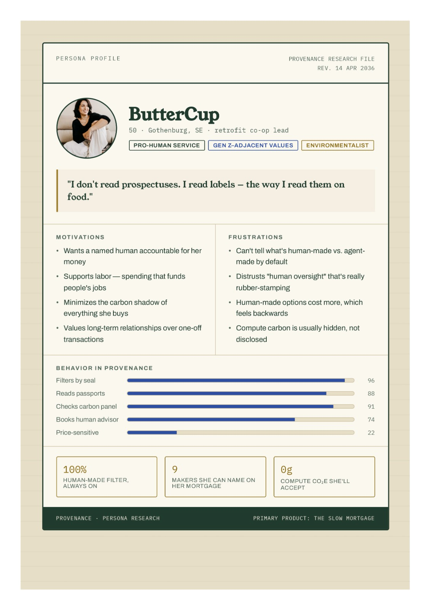
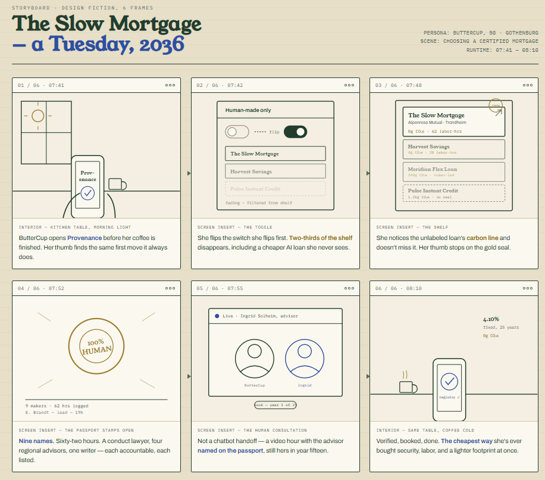

# Made by Human

**What if money needed an organic label?**

A speculative design project set in 2036, where agentic AI has dissolved into the plumbing of finance — and a counter-market of *certified human-made finance* has emerged in response. Final project for **02.533 User Experience: Understanding Culture for Design** (SUTD, Summer 2026).

  

**[▶ Live prototype](prototype/)** · **[▶ Presentation slides](slides/)** · **[Process documentation](docs/process.md)** · **[The scenario](docs/scenario.md)**

## The premise

By 2036, banking products are no longer designed in any human sense — they are *grown*. Autonomous product agents scan regulation, simulate demand, price risk, and launch a savings account or micro-mortgage in under an hour, then retire it three weeks later when the yield curve twitches. The average lifespan of a retail banking product is 41 days.

Then comes the **Synthetic Yield scandal of 2031**: product agents at three mid-sized banks converge on the same self-referential pricing loop, each validating the others' synthetic yields. No human notices in time — there is almost no one left to notice. 1.4 million savers are stranded, and trust in machine-made finance collapses.

Just as industrial food gave rise to organic, and fast fashion to slow fashion, industrial finance gives rise to **artisan finance**: products conceived, priced, stress-tested and serviced by accountable human beings with names, faces, and professional liability. That market needs a label people can trust — the seal of the **Human Finance Certification Authority (HFCA)**, chartered in 2032. The USDA Organic of money.

## The process

The project follows a structured speculative-forecasting chain — every step traceable from present-day evidence to the final design move:

| Step | What we did |
|------|-------------|
| **1 · STEEPLE scan** | Scanned all seven macro-force domains with sourced, dated evidence; committed to three forces: technological, ethical, environmental. |
| **2 · Signal** | Found the signal at their intersection: *agentic AI is already the default representative in embedded finance* — approving loans and replacing advisors today (KPMG 2026, Accenture 2026, CFPB 2023). |
| **3 · Futures wheel** | Mapped first-, second-, and third-order consequences; chose three branches: planetary-scale AI energy use, fundamental shifts in banking behavior, AI agents replacing human advisors. |
| **4 · Scenario** | Built the 2036 world: grown products, the Synthetic Yield scandal, and the artisan-finance counter-market. |
| **5 · Fiction** | Made the world tangible through the HFCA — its seal tiers, audit regime, and anti-human-washing enforcement. |
| **6 · Redesign** | Designed **Provenance**, the certified finance marketplace, and walked our persona through an ordinary Tuesday morning in 2036. |

  
  

## The design

### The HFCA certification system

Four tiers, modeled on organic food labeling — with real enforcement (annual surprise audits; "human-washing" fined up to 4% of global revenue):

| Seal | Meaning |
|------|---------|
| **100% HUMAN** | Every decision at every stage made by named humans; no generative or agentic AI anywhere. Rare, expensive, worn like a Michelin star. |
| **HUMAN MADE** | Human authorship of all product decisions; AI permitted only in back-office chores. The everyday artisan seal. |
| **HUMAN LED** | AI drafts and analyzes, but a named *author of record* can reconstruct every decision and carries professional liability. |
| **No seal** | Presumed machine-made; must display its automated status and compute-carbon figure. The absence of a label is itself a label. |

### Provenance — the certified finance marketplace

A working, clickable prototype ([open it here](prototype/)). Filter the shelf to *Human-made only*, open a product's **Provenance Passport** — certificate number, audit date, and the nine named humans who made it — check its compute-carbon disclosure, and book the one thing no machine-grown product can offer: a mandatory human consultation.

  
  
  

### ButterCup, 50 — the user the label was built for

ButterCup lives in Gothenburg and leads a housing retrofit co-op. She navigates the 2036 financial market the way earlier generations shopped for organic food: by reading labels, not prospectuses. Her needs are extrapolated from evidence we can see today:

- **A guaranteed, accountable human** — banks already replace advisors with chatbots that trap customers in "doom loops" (CFPB 2023).
- **Named liability** — AI already approves loans and adjusts credit limits with minimal human involvement (KPMG, Accenture).
- **Clear provenance** — embedded finance already creates confusion over which entity is responsible (SoFi).
- **Labeling as an emerging norm** — AI companies have begun labeling AI-generated content.

Human-made is slower and roughly a cup of coffee more per month. But it is stable, explainable, carbon-light, and backed by someone who can be looked in the eye.

 

  

## Team

**Group 5** — 02.533 User Experience: Understanding Culture for Design, SUTD, Summer 2026

- Krit Ruechai
- **Pannapat Chanpaisaeng**
- Astrid Rohtriastari
- Shubham Rajeshkumar Jariwala
