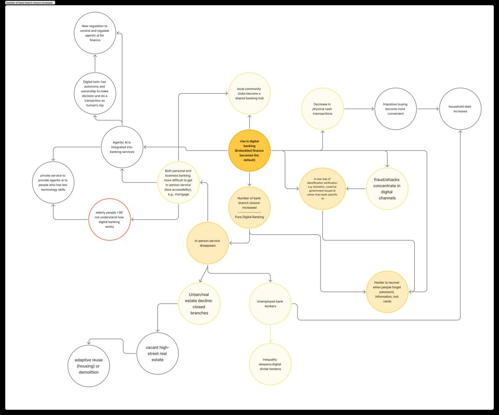
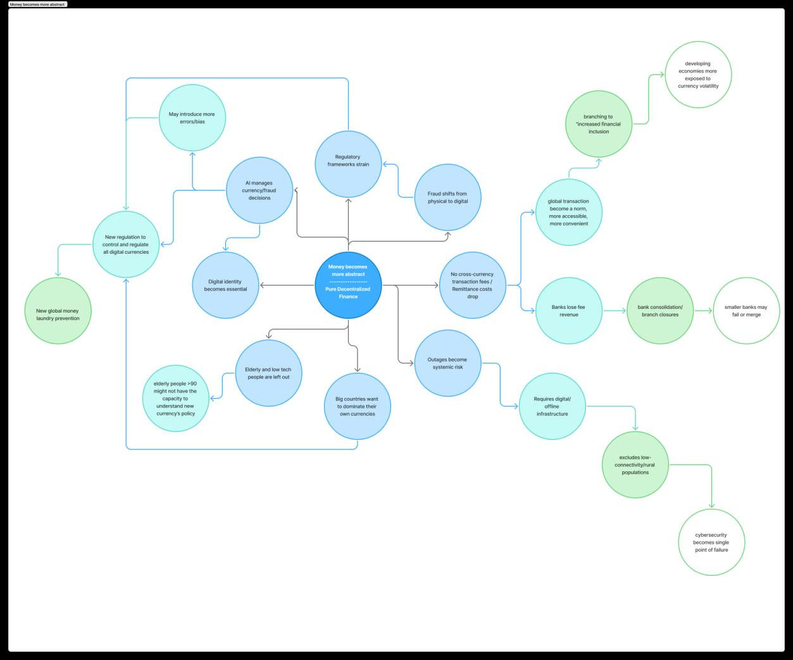
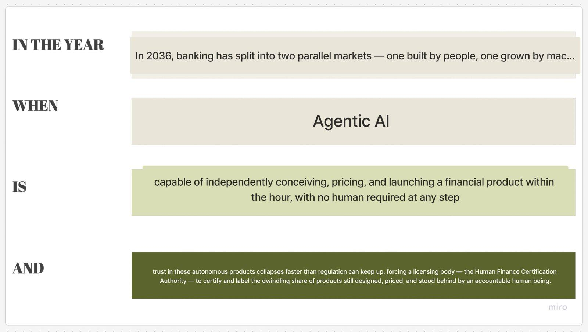

# Process Documentation

The speculative-forecast chain, from present-day evidence to design move: **scan → signal → wheel → branch → scenario → redesign**.

## 1 · STEEPLE scan

We scanned all seven STEEPLE domains (Social, Technological, Economic, Environmental, Political, Legal/Policy/Regulatory, Ethical) with sourced, dated evidence, then committed to three forces for the project: **technological**, **ethical**, and **environmental**.

## 2 · Signal

The scan surfaced two early directions — the rise of digital banking (embedded finance as the default access to financial products) and pure decentralized finance (money detached from institutions). Both pointed to the same underlying shift: financial decisions migrating away from visible, accountable human institutions.

Our signal sits at the intersection of the three chosen forces: **agentic AI is already operating inside embedded finance, making consequential decisions with minimal human involvement.** Today, AI agents approve or reject loans, adjust credit limits, and flag accounts (KPMG 2026; Accenture 2026), while the CFPB has documented banks replacing human advisors with chatbots that trap customers in unresolvable "doom loops" (CFPB 2023). These decisions are increasingly buried inside non-bank platforms — shopping and travel apps — creating documented confusion over who is responsible when something goes wrong (SoFi).

## 3 · Futures wheels

We built two exploratory wheels from the early directions, then a final wheel around the chosen center: **"Agentic AI becomes the default representative in embedded finance."**

| Exploratory wheel 1 | Exploratory wheel 2 |
|---|---|
|  |  |

The final wheel maps first-, second-, and third-order consequences across technology, ethics, environment, and governance:

## 4 · Chosen branches

Three branches (highlighted in red on the wheel) define the tensions of the speculative world:

1. **Agentic AI consumes energy at a planetary scale**
2. **Banking behavior changes fundamentally**
3. **AI agents replace human financial advisors**

Together: a financial system that is cheap, instant, and human-free — but carbon-heavy, opaque, and unaccountable — and the counter-market of certified human-made finance that emerges in response.

## 5 · Scenario and fiction

The scenario ([full text](scenario.md)) establishes the 2036 world: grown products with a 41-day average lifespan, the Synthetic Yield scandal of 2031 stranding 1.4 million savers, the 2033 EU–ASEAN Provenance Accord, and the Human Finance Certification Authority chartered in 2032 as "the USDA Organic of money."

The design fiction is made tangible through the HFCA's certification system — four seal tiers (100% HUMAN / HUMAN MADE / HUMAN LED / no seal), per-product annual certification, surprise audits, and fines of up to 4% of global revenue for "human-washing."

## 6 · Design move

The redesign is **Provenance**, a certified finance marketplace, experienced through the persona **ButterCup** (50, Gothenburg, housing retrofit co-op lead) — a member of the pro-human, environmentally conscious cohort who reads labels, not prospectuses. Her future needs are each justified by present-day evidence: CFPB doom-loops (guaranteed human access), KPMG/Accenture agentic-AI lending (named liability), SoFi responsibility-confusion (provenance), and the emerging norm of AI-content labeling.

The [working prototype](../prototype/) demonstrates the full flow: filtering the shelf to human-made products, inspecting a Provenance Passport, checking compute-carbon disclosures, and booking a mandatory human consultation.
